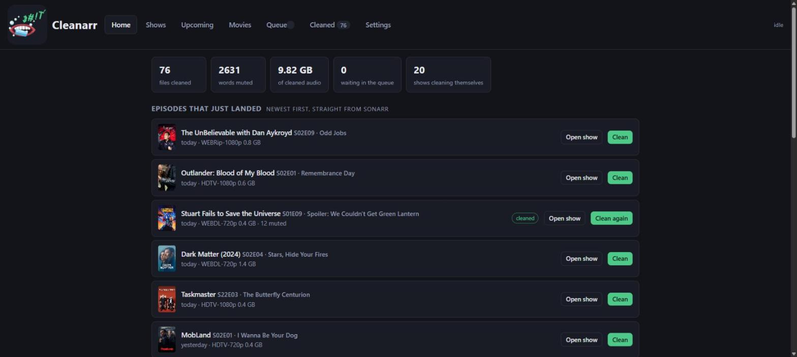
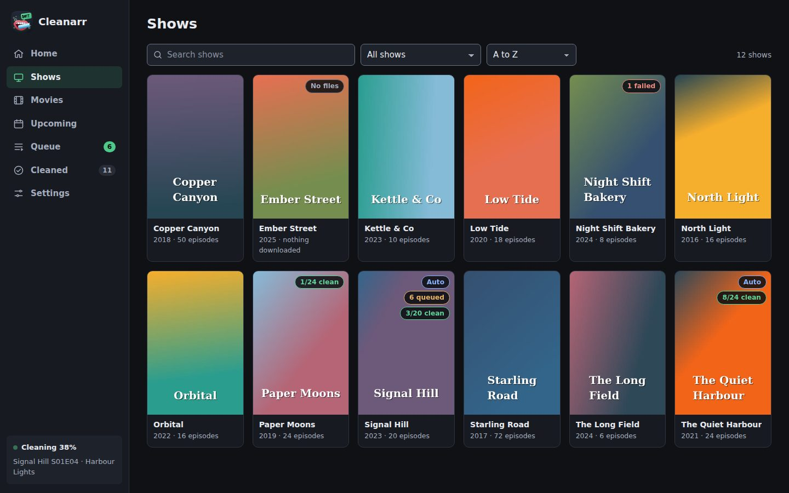
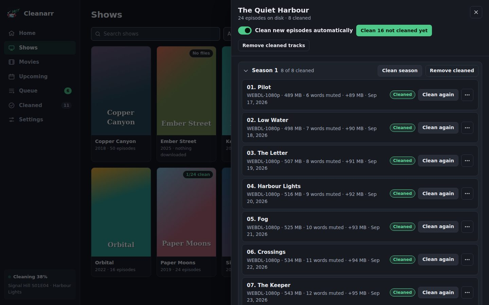
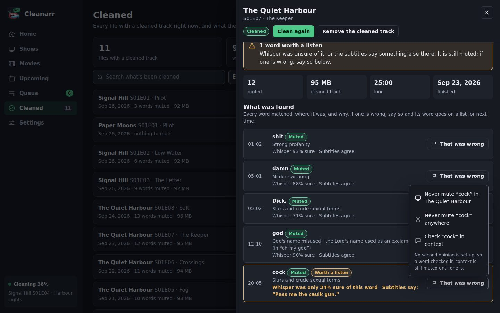
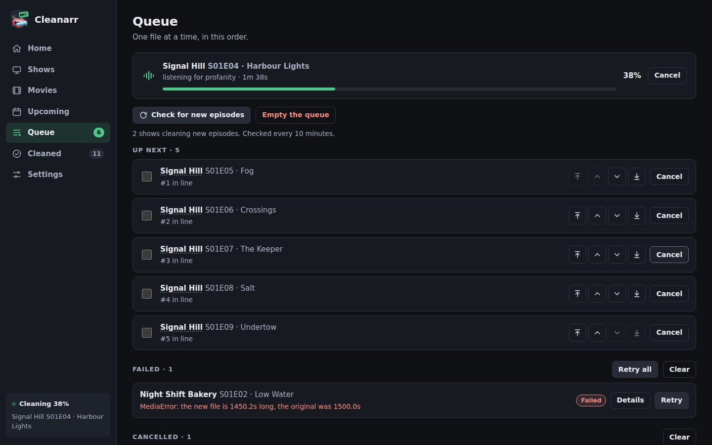
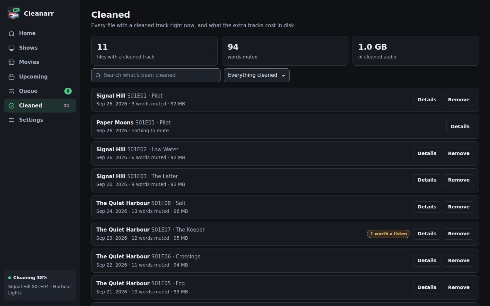
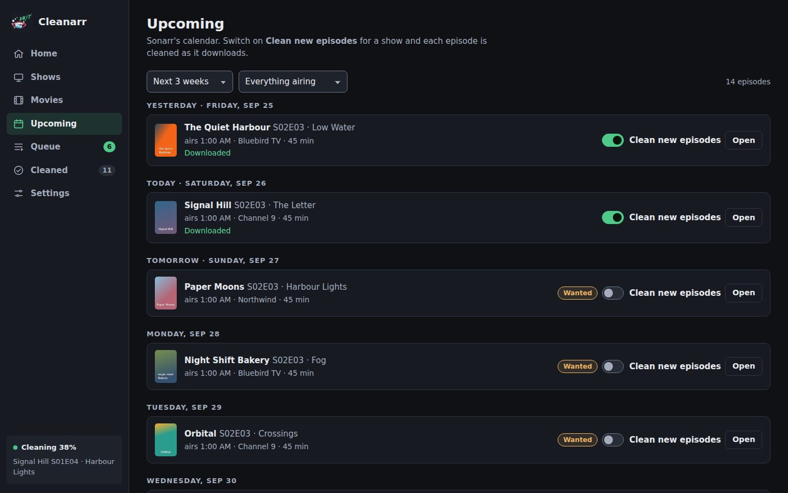
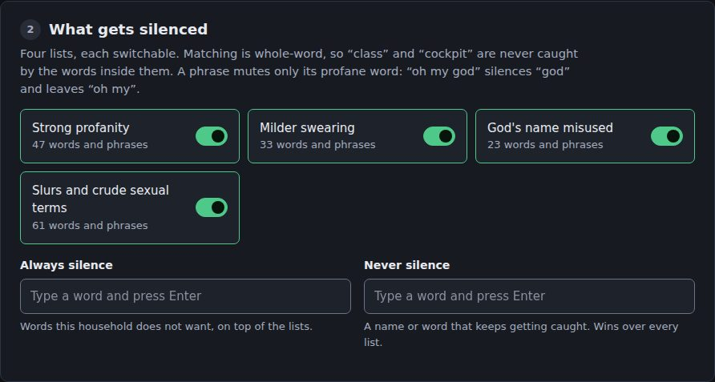
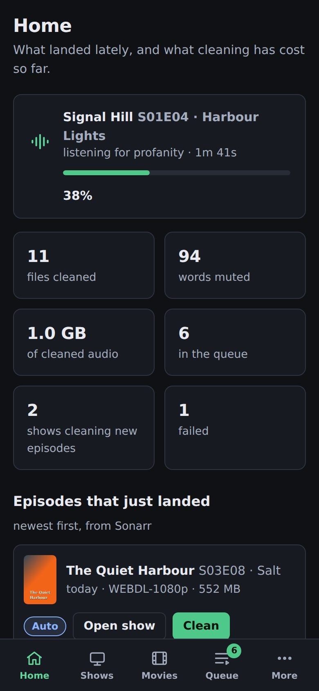

# Cleanarr


Cleanarr is an \*arr-inspired, *vibe-coded* application that mutes profanity in your 
media.

It adds a second audio track, **“Cleaned - English”** by default, with the swearing
silenced. The original is untouched and stays the default — in Plex or Jellyfin
you pick the clean one from the audio menu. **One file, two tracks, not two
copies.**

Built for a household with a small child in the room, so when anything is
uncertain the word gets muted.

```
 your library ──▶ queue ──▶ ffmpeg ──▶ Whisper ──▶ word list
                                                       │
                         file with a new track ◀── mute + remux
```

---

## What it looks like

The screenshots are of a made-up demo library (`python tools/screenshots.py`
regenerates them), in the dark theme. The page follows the system's light or
dark setting.

**Home** — what is being cleaned, what landed lately, and what it has cost so
far. On a new install it opens with a checklist of what is left to set up.



**Your library**, with badges for cleaned, queued, auto-cleaning, or nothing on
disk yet.



**Inside a show** — clean one episode, a season, everything outstanding, or
from one episode to the end. Removing a cleaned track is just as easy.



**Every mute is on the record**, with what Whisper thought of the word and what
the file's subtitles say at that moment. When one is wrong — Whisper heard a
name as a swear — **That was wrong** puts the word on a list: never mute it in
this show, never mute it anywhere, or check it in context. A word the second
opinion let through can be made always muted.



**The queue** — one file at a time, reorderable, with what is running now.



**Cleaned** — searchable history, and what the extra tracks cost in disk.



**Upcoming** — Sonarr's calendar without leaving the app. Sonarr only; the tab
hides itself otherwise.



**Settings** are numbered in the order they need doing, and nothing is saved
until you press Save. Each Test button tries what is typed, before it is saved.



**On a phone** the sidebar becomes a bar along the bottom.



---

## Requirements

| | |
|---|---|
| **A library** | Sonarr + Radarr, **or** Plex, **or** Jellyfin. Read-only — Cleanarr never writes to any of them. |
| **Media** | Reachable from this container. The paths do not have to match your library's; see [Paths](#paths). |
| **GPU** | Optional. NVIDIA is much faster; CPU works. See [Hardware](#hardware). |
| **Disk** | ~1.5 GB for the speech model, plus ~90 MB per cleaned 25-minute episode. |
| **Ollama** | Optional, off by default. See [The second opinion](#the-second-opinion). |

---

## Installing

### Docker Compose

```yaml
services:
  cleanarr:
    image: ghcr.io/geoguy89/cleanarr:latest
    container_name: cleanarr
    restart: unless-stopped
    stop_grace_period: 45s
    ports:
      - "8477:8477"
    volumes:
      - /path/to/appdata/cleanarr:/config
      # The right-hand side must be the path your library reports.
      # If Plex or Sonarr says /data/media/tv/..., mount it as /data.
      - /path/to/media:/data
    environment:
      - TZ=America/New_York
```

```bash
docker compose up -d
```

**With an NVIDIA GPU**, add this to the service as well:

```yaml
    environment:
      - NVIDIA_VISIBLE_DEVICES=all
      - NVIDIA_DRIVER_CAPABILITIES=compute,utility
    deploy:
      resources:
        reservations:
          devices:
            - driver: nvidia
              count: all
              capabilities: [gpu]
```

> Add it **only** if you have one. Docker will not start a container whose
> device reservation cannot be met, so on a machine with no NVIDIA card these
> lines stop Cleanarr running at all, with an error that says nothing about
> Cleanarr.

> Also on Docker Hub as `geoguy89/cleanarr:latest`. GHCR is the better
> default — Docker Hub rate-limits anonymous pulls.

### docker run

```bash
# The container side of the media volume must be the path your library
# reports: Cleanarr opens those paths unchanged.
docker run -d \
  --name cleanarr \
  --restart unless-stopped \
  -e TZ=America/New_York \
  -p 8477:8477 \
  -v /path/to/appdata/cleanarr:/config \
  -v /path/to/media:/data \
  ghcr.io/geoguy89/cleanarr:latest
```

With an NVIDIA GPU, add `--runtime nvidia -e NVIDIA_VISIBLE_DEVICES=all -e
NVIDIA_DRIVER_CAPABILITIES=compute,utility`.

### Unraid

Copy `docker/my-Cleanarr.xml` to
`/boot/config/plugins/dockerMan/templates-user/`, then **Docker → Add
Container** and pick *cleanarr* from the template dropdown. That gives you the
icon, a WebUI link and a working Edit dialog. Updates work normally — the
template pulls from ghcr.io.

### Building it yourself

The published image is `linux/amd64` only; its CUDA base has no arm64 build.

```bash
git clone https://github.com/geoguy89/cleanarr.git
cd cleanarr/docker && docker compose up -d --build
```

### Hardware

Listening is the only demanding part.

| | Speed |
|---|---|
| **NVIDIA GPU** | ~85 s for a 25-minute episode |
| **CPU only** | Several times slower. Queue it overnight. |
| **AMD GPU** | Runs, but on the CPU — see below |

Cleanarr picks GPU or CPU on its own. **Settings → Listening** shows which it
found and lets you force either.

faster-whisper runs on CTranslate2, which has CPU and CUDA backends and **no
ROCm**, so an AMD card sits idle. To use one, run something that supports it —
[whisper.cpp](https://github.com/ggml-org/whisper.cpp) has Vulkan and ROCm
backends — and point Cleanarr at it under **Settings → Listening → Use my own
Whisper server**. Anything exposing the OpenAI transcription API works.

> A remote server must return **word-level** timestamps. Cleanarr mutes half a
> second around one word; with only line-level timings it would have to blank
> four seconds of dialogue to catch one syllable. The **Test** button checks
> for this.

---

## First run

Open `http://<host>:8477`. **Home** shows a checklist of what is left to do,
with a link to each fix; it goes away once everything is done. **Settings** is
numbered in the order things need doing:

1. **Your library** — Sonarr + Radarr, Plex or Jellyfin, with a test button,
   and a check that each library folder opens from inside the container.
2. **What gets silenced** — four switchable lists, plus your own always/never
   words.
3. **Listening** — download the speech model here rather than during your first
   clean.
4. **Muting** — padding, fade and the new track's name. The defaults are fine.
5. **Second opinion** — optional, off by default.
6. **Media server** — optional, for refreshing and pausing during transcodes.
7. **Advanced** — bitrates, ffmpeg threads, number format, keeping backups.
8. **Who can use this** — set a password if this is reachable from outside your
   network.

A value Cleanarr cannot use — an address without `http://`, a padding of 9
seconds — is refused when you save, with the reason next to the field.

Then clean one episode before turning it loose on a season.

### Where the library comes from

Cleanarr needs one thing: what you own, and where each file is.

| Source | Needs | Notes |
|---|---|---|
| **Sonarr + Radarr** | both, with API keys | Knows the most, and the only one that can fill the Upcoming calendar |
| **Plex** | address + token | No \*arr apps needed. Artwork comes from Plex too. |
| **Jellyfin** | address + API key | Same again |

Everything else works the same whichever you pick, including cleaning new
episodes automatically. The Plex and Jellyfin credentials are the same ones
used for refreshing and transcode pauses — there is no second set to keep in
step.

### Paths

Your library reports where each file is **as it sees it**, and Cleanarr opens
that exact path. So mount your media so that **the path your library reports
exists inside this container**:

```yaml
volumes:
  # Left: where the media is on the host.
  # Right: what your library calls it. Sonarr and Plex in containers usually
  # report something like /data/media/tv/..., so the media is mounted as /data.
  - /mnt/user/data:/data
```

The two often do not agree — a Plex server on another machine, or one reaching
storage over its own mount, reports paths that mean nothing here. The symptom
is the library browsing perfectly while every job fails with *“not found from
this container”*.

**Settings → Your library** shows a check for each library folder: what it
reports and whether Cleanarr can open it. When it cannot, it also says where
that folder looks to be mounted instead, so the fix is usually one line of the
compose file.

There is no path-rewriting setting, deliberately. The media has to be mounted
into this container either way — NFS or SMB from another machine is fine, it
just has to be mounted — and once it is being mounted, mounting it at the path
the library reports costs nothing and leaves one fewer thing to get wrong.

---

## How it works

1. **Probe** — ffprobe reads the file. One already carrying a cleaned track is
   skipped unless you ask again.
2. **Extract** — the English audio, as 16 kHz mono.
3. **Listen** — Whisper transcribes with **word-level** timestamps. A subtitle
   line says a swear happened somewhere in four seconds; words give ~50 ms.
4. **Match** — whole words only, so *class* and *cockpit* are never caught. A
   phrase mutes only the profane word: *“oh my god”* silences *god*.
5. **Mute** — each match silenced with a 20 ms fade at each edge.
6. **Verify, then swap** — the new file replaces the original **only** after
   ffprobe confirms every original stream is present plus one, at the same
   duration, correctly interleaved.

Transcripts are cached against the audio, so changing a word list and
re-cleaning skips the slow part.

---

## Keeping the right words

When anything is uncertain the word is muted — that is the default, and nothing
below changes it. What these do is keep innocent words out of the lists in the
first place, and make the rare wrong call quick to find and fix.

**Before anything is muted**

* **Whole words only.** *class*, *assassin* and *cockpit* are never caught by
  what is inside them.
* **Endings are not guessed.** Only plurals and possessives are added
  automatically. *cocky*, *cocker* (spaniel), *booby* (trap) and *damning*
  (evidence) were all muted once when endings were guessed, so every wanted
  form — *fucking*, *shitty*, *pissed* — is listed by hand.
* **A built-in never list** of words that contain or sound like a listed one
  (*cucumber*, *Dickens*, *title*, *assess*…), and words deliberately left off
  the lists because their ordinary sense is far more common: *bloody*,
  *screwed*, *cracker*, and three slurs that in real use only ever turned up as
  *a chink in his armour*, a surname or raccoons, and a *Van Dyke* beard.
* **The Lord's name only as an exclamation.** A phrase such as *oh my god*
  mutes *god*; *Jesus* or *Christ* on its own is left alone near words like
  *pray*, *amen* or *gospel*, as long as it is on the check-in-context list
  (it is by default). Only the profane word of a phrase is muted, so *oh my*
  stays audible.
* **Your own lists**: always silence, never silence, and exceptions for one
  show or film (a character called Dick keeps his name without the insult
  being left in everywhere else).
* **The [second opinion](#the-second-opinion)**, optional, for words with a
  real innocent meaning — *caulk* heard as the other word.

**After a clean: what is worth a listen**

Each detection records two pieces of evidence. Neither changes the muting:

* **How sure Whisper was** of the word. Below 50%, it is flagged. The
  built-in Whisper always reports this; a remote server only if it adds it to
  the OpenAI response. Transcripts saved before this version have none, and
  are reused on a re-clean; deleting `/config/cache` makes files be heard
  again.
* **What the subtitles say** at that moment, when the file has English text
  subtitles (SRT, ASS, MP4 text; picture subtitles cannot be read). If the
  line on screen has a different, innocent word — *“Pass me the caulk gun”* —
  it is flagged and the line is quoted. A censored line (*f\*\*\**,
  *[bleep]*) counts as agreeing. If most lines in a file disagree, the
  subtitles are taken to belong to another release and set aside for that
  file rather than flagging everything.

Flagged words are marked **Worth a listen** in the job's details, and the
Cleaned page can show only the files that have one. **That was wrong** on the
word fixes it for next time; **Clean again** applies it now, and reuses the
saved transcript, so the slow listening step is skipped.

---

## Where things are kept

**The cleaned track is inside the media file itself**, as one more audio
stream next to the original. There is no second copy of the episode and no
separate audio file: Plex or Jellyfin simply shows one more entry in the
episode's audio menu. The original audio stream is copied across untouched and
stays the default.

How a file gets there:

1. The new file is built in a scratch folder **beside the original**, named
   `cleanarr-` plus a random suffix (e.g. `Show/Season 01/cleanarr-x1y2z3/`).
   It sits on the same disk so the finished file can be moved into place
   without copying. That needs free space of about the file's size plus
   512 MB; a job that does not have it stops before starting.
2. Once it verifies, the new file **replaces the original at the same path**,
   keeping its owner, permissions and modification time, so the library does
   not think the episode is new.
3. The scratch folder is deleted, whether the job worked or not. One left by a
   container killed mid-job is swept up the next time a job runs in that
   folder, once it is six hours old.

The file grows by the size of the cleaned track, about 90 MB for a 25-minute
episode; the Cleaned page shows the running total. **Remove** rewrites the file
without that track and gives the space back.

**Keep a copy of each original** (Settings → Advanced, off by default) also
leaves `<file name>.cleanarr-backup` beside each file, doubling what it takes
on disk. The copy is refreshed each time the file is changed, so after a second
clean or a removal it holds the file as it was just before that change.

Everything else lives in `/config`:

| Path | What |
|---|---|
| `/config/config.yaml` | Settings, including API keys and the login's password hash |
| `/config/cleanarr.sqlite` | Job history, every detection, shows set to clean new episodes, second-opinion answers |
| `/config/cache/models/` | The speech model, about 1.5 GB |
| `/config/cache/*.json` | Transcripts, so a re-clean after a word-list change skips listening |
| `/config/cache/posters/` | Artwork, fetched once |
| `/config/cache/huggingface/` | Hugging Face's own download cache |

Deleting `/config/cache` is safe: the model downloads again and files are
listened to again. Deleting `cleanarr.sqlite` loses the history and the list
of shows cleaning new episodes; the tracks in your files stay, and ones written
by this version are still recognised as Cleanarr's from the file alone.

---

## The second opinion

**Optional, off by default, and most people should leave it off.**

Speech recognition writes homophones. A scene about drywall produced nine mutes
of *“cock”* — the word was *“caulk”*. No word list fixes that, because the
transcript genuinely contains the rude one.

So a word you list is sent to **your own Ollama** — or any server with an
OpenAI-compatible chat API — with the sentence around it, and is left in only
if the model names the ordinary word it heard instead. Nothing leaves your
network; a blank address skips the step, and the listed words are simply
muted.

Across 196 checks on a real library it changed the outcome **twice**, at
30–100 s each — hence the default. Anything unanswered stays muted.

---

## Shows that clean themselves

Marking a show cleans **episodes downloaded from now on**. Nothing already on
disk is touched; catching up is a separate button. A show with no files yet can
be marked, so a new series arrives clean.

Checked every 10 minutes. For instant cleaning, point a Sonarr **Connect →
Webhook** (*On Import*) at `http://<host>:8477/api/webhook/sonarr`. If you
have set a login, put the same username and password in the webhook's
Username and Password fields.

---

## Things worth knowing

* **medium.en is the only model offered.** large-v3 took 50% longer and caught
  *fewer* swears — it favours tidy prose, and tidy prose smooths swearing away.
* **Whisper's silence filter is off.** On one 43-minute episode it skipped 19
  real profanities and saved no measurable time.
* **Nothing is written until it verifies.** An early build produced a file Plex
  hung on, because the cleaned audio landed 485 MB from the picture inside the
  container. The interleave check exists because of that episode.
* **One job at a time**, on purpose — the GPU is shared.

---

## Development

```
server/cleanarr/
  words.py      word lists and whole-word matching
  subtitles.py  checks detections against the file's subtitles
  judge.py      the second opinion
  asr.py        Whisper, local or remote, with caching
  media.py      ffprobe/ffmpeg: probe, mute, remux, verify, swap
  library.py    Sonarr/Radarr, Plex or Jellyfin as the library
  pipeline.py   one file, start to finish
  worker.py     the queue
  arr.py        Sonarr, Radarr, Plex and Jellyfin clients
  auth.py       optional login
  main.py       API and static page
  validate.py   checks a settings save
web/            the page
tests/          pytest suite; demo.py is a made-up library for the UI tests
```

Tests need ffmpeg on the PATH. The end-to-end tests also need espeak-ng, and
download Whisper `tiny.en` (~75 MB) the first time.

```bash
pip install -r server/requirements.txt -r tests/requirements.txt
python -m pytest -m "not e2e and not ui"   # words, queue, API, real ffmpeg
python -m pytest -m e2e                     # speech -> Whisper -> cleaned MKV and MP4
python -m pytest -m ui                      # the page in Chromium
python tests/demo.py                        # the demo library on :8477
```

The UI tests also need Chromium for Playwright:
`python -m playwright install chromium`.

Set `CLEANARR_TEST_MODELS` to a folder to keep the model between runs. No
Sonarr, Plex, Jellyfin or Ollama is needed: the tests start small local
stand-ins for them.

---

## Licence

MIT — see [LICENSE](LICENSE).
