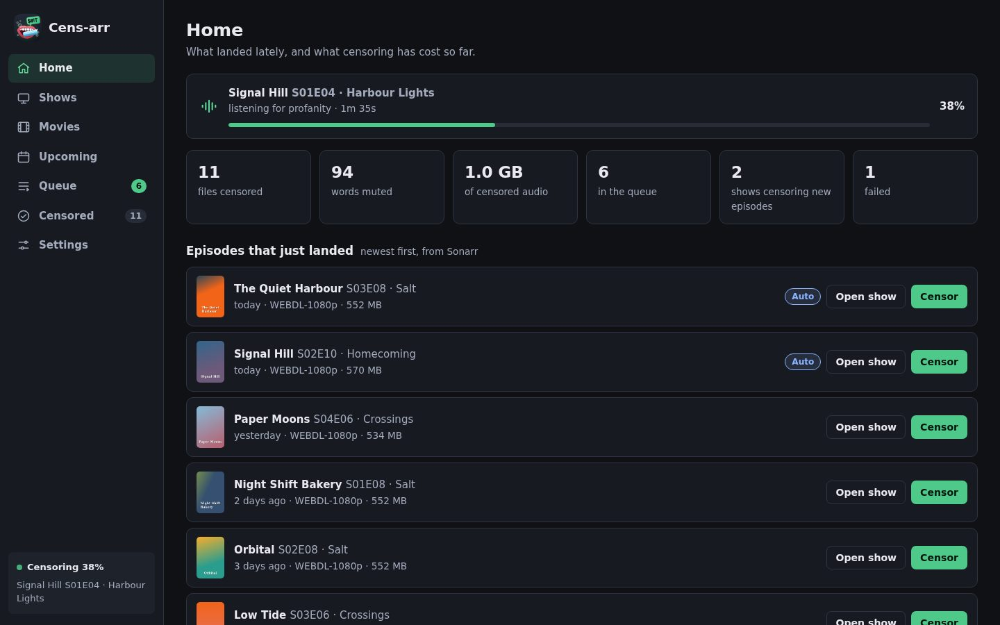
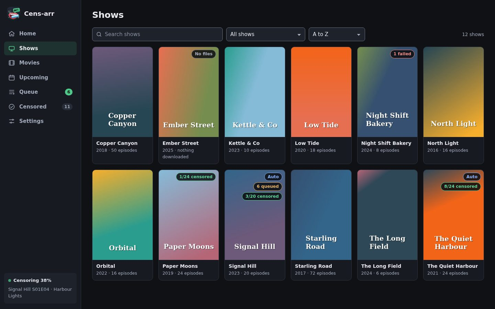
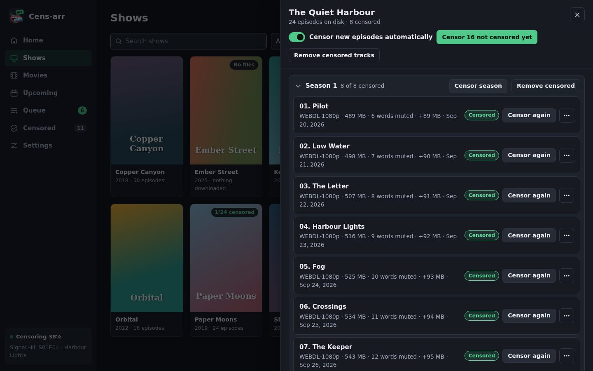
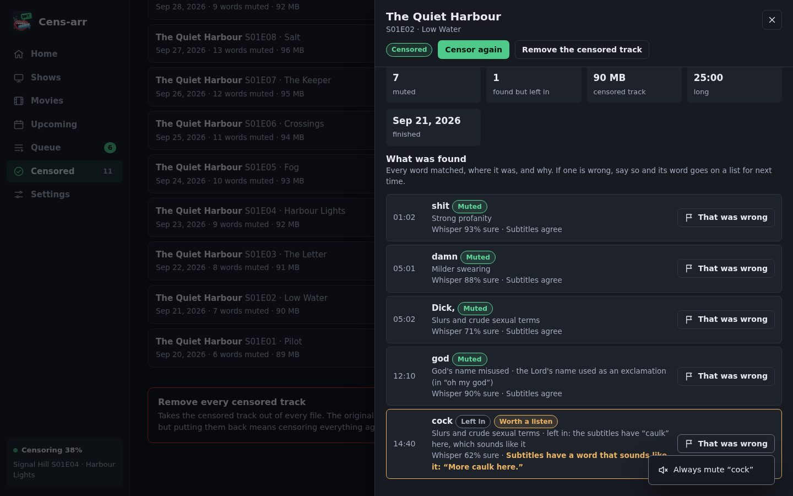
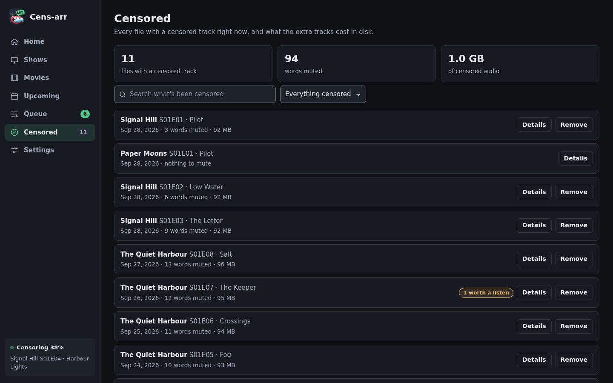
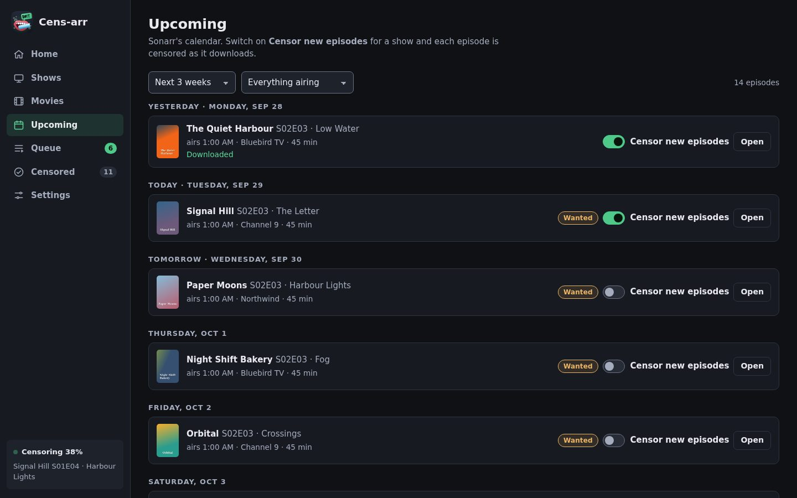
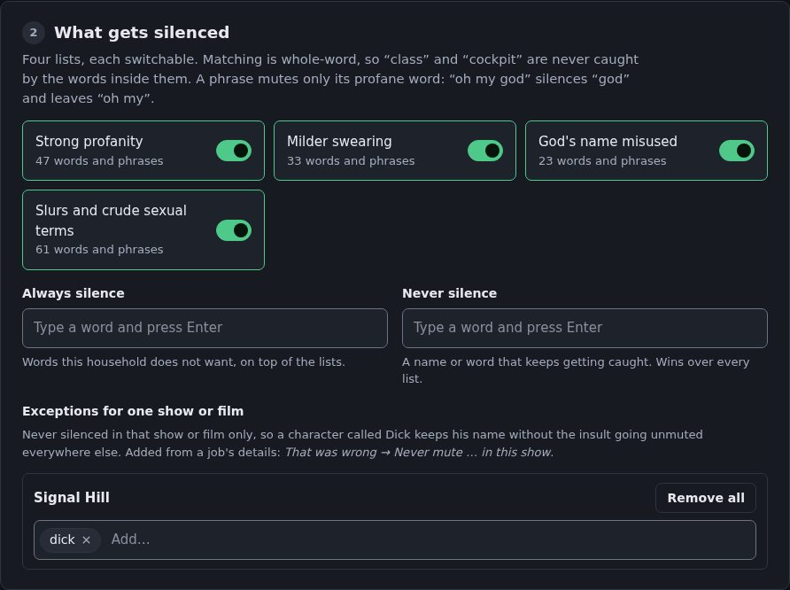
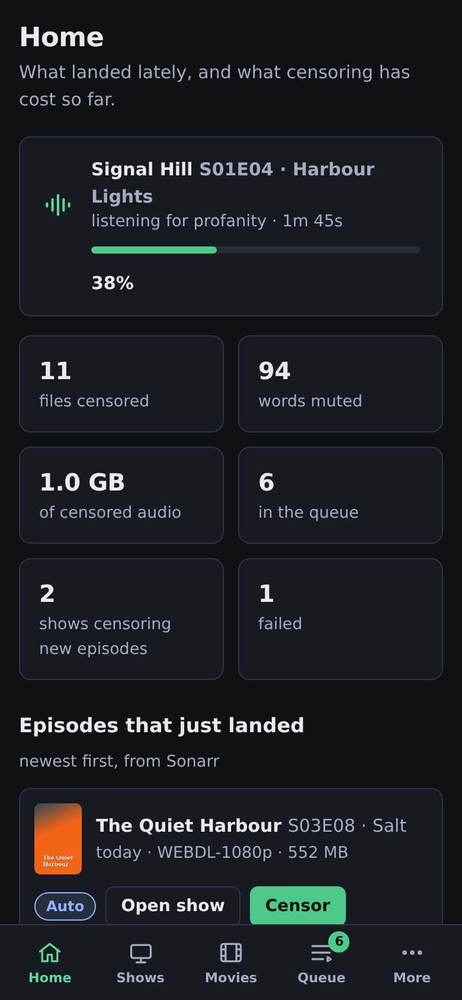

# Cleanarr


Cleanarr is an \*arr-inspired, *vibe-coded* application that mutes profanity in your 
media.

It adds a second audio track, **“Cleaned - English”** by default, with the swearing
silenced. The original is untouched and stays the default — in Plex or Jellyfin
you pick the clean one from the audio menu. **One file, two tracks, not two
copies.**

Built for a household with a small child in the room, so when anything is
uncertain the word gets muted.

```
 your library ──▶ queue ──▶ ffmpeg ──▶ Whisper ──▶ word list ──▶ subtitles
                                                                    │
                                   file with a new track ◀── mute + remux
```

* **Word-accurate muting** — Whisper gives each word's time to ~50 ms, so only
  the swear goes silent, not the line around it.
* **Subtitles and Whisper check each other** — every swear either one finds is
  read against the other. A harmless word Whisper heard as a swear stays in
  when the subtitles have a word that *sounds like it* (*“Pass me the caulk
  gun”*); a swear Whisper missed is muted from the subtitles. Subtitles come
  from the file, a `.srt` beside it, or Plex or Jellyfin, which search for them
  online, and are lined up with the speech first.
* **One click to fix a wrong call**, per show or everywhere, and every mute is
  listed with its evidence.
* **Shows that clean themselves** as new episodes arrive, from Sonarr, Plex or
  Jellyfin.

---

## What it looks like

The screenshots are of a made-up demo library (`python tools/screenshots.py`
regenerates them), in the dark theme. The page follows the system's light or
dark setting.

**Home** — what is being cleaned, what landed lately, and what it has cost so
far. On a new install it opens with a checklist of what is left to set up.



**Your library**, with badges for cleaned, queued, auto-cleaning, or nothing on
disk yet.



**Inside a show** — clean one episode, a season, everything outstanding, or
from one episode to the end. Removing a cleaned track is just as easy.



**Every mute is on the record**, with what Whisper thought of the word and what
the file's subtitles say at that moment. When one is wrong — Whisper heard a
name as a swear — **That was wrong** puts the word on a list: never mute it in
this show, never mute it anywhere, or check it in context. A word the second
opinion let through can be made always muted.



**Cleaned** — searchable history, and what the extra tracks cost in disk.



**Upcoming** — Sonarr's calendar without leaving the app. Sonarr only; the tab
hides itself otherwise.



**Settings** are numbered in the order they need doing, and nothing is saved
until you press Save. Each Test button tries what is typed, before it is saved.



**On a phone** the sidebar becomes a bar along the bottom.



---

## Requirements

| | |
|---|---|
| **A library** | Plex or Jellyfin, optionally with Sonarr for shows. Only asked what exists — except that the subtitle search asks Plex or Jellyfin to attach subtitles it finds (see [The subtitles](#the-subtitles)). |
| **Media** | Mounted so the paths your library reports exist in this container; see [Paths](#paths). |
| **Subtitles** | Optional, and used when there: in the file, a `.srt` beside it, or found by Plex or Jellyfin. |
| **GPU** | Optional. NVIDIA is much faster; CPU works. See [Hardware](#hardware). |
| **Disk** | ~1.5 GB for the speech model, plus ~90 MB per cleaned 25-minute episode. |
| **Ollama** | Optional, off by default. See [Subtitles and Whisper](#subtitles-and-whisper). |

---

## Installing

### Docker Compose

```yaml
services:
  cleanarr:
    image: ghcr.io/geoguy89/cleanarr:latest
    container_name: cleanarr
    restart: unless-stopped
    stop_grace_period: 45s
    ports:
      - "8477:8477"
    volumes:
      - /path/to/appdata/cleanarr:/config
      # The right-hand side must be the path your library reports.
      # If Plex or Sonarr says /data/media/tv/..., mount it as /data.
      - /path/to/media:/data
    environment:
      - TZ=America/New_York
```

```bash
docker compose up -d
```

**With an NVIDIA GPU**, add this to the service as well:

```yaml
    environment:
      - NVIDIA_VISIBLE_DEVICES=all
      - NVIDIA_DRIVER_CAPABILITIES=compute,utility
    deploy:
      resources:
        reservations:
          devices:
            - driver: nvidia
              count: all
              capabilities: [gpu]
```

> Add it **only** if you have one. Docker will not start a container whose
> device reservation cannot be met, so on a machine with no NVIDIA card these
> lines stop Cleanarr running at all, with an error that says nothing about
> Cleanarr.

> Also on Docker Hub as `geoguy89/cleanarr:latest`. GHCR is the better
> default — Docker Hub rate-limits anonymous pulls.

### docker run

```bash
# The container side of the media volume must be the path your library
# reports: Cleanarr opens those paths unchanged.
docker run -d \
  --name cleanarr \
  --restart unless-stopped \
  -e TZ=America/New_York \
  -p 8477:8477 \
  -v /path/to/appdata/cleanarr:/config \
  -v /path/to/media:/data \
  ghcr.io/geoguy89/cleanarr:latest
```

With an NVIDIA GPU, add `--runtime nvidia -e NVIDIA_VISIBLE_DEVICES=all -e
NVIDIA_DRIVER_CAPABILITIES=compute,utility`.

### Unraid

Copy `docker/my-Cleanarr.xml` to
`/boot/config/plugins/dockerMan/templates-user/`, then **Docker → Add
Container** and pick *cleanarr* from the template dropdown. That gives you the
icon, a WebUI link and a working Edit dialog. Updates work normally — the
template pulls from ghcr.io.

### Building it yourself

The published image is `linux/amd64` only; its CUDA base has no arm64 build.

```bash
git clone https://github.com/geoguy89/cleanarr.git
cd cleanarr/docker && docker compose up -d --build
```

### Hardware

Listening is the only demanding part.

| | Speed |
|---|---|
| **NVIDIA GPU** | ~85 s for a 25-minute episode |
| **CPU only** | Several times slower. Queue it overnight. |
| **AMD GPU** | Runs, but on the CPU — see below |

Cleanarr picks GPU or CPU on its own. **Settings → Listening** shows which it
found and lets you force either.

faster-whisper runs on CTranslate2, which has CPU and CUDA backends and **no
ROCm**, so an AMD card sits idle. To use one, run something that supports it —
[whisper.cpp](https://github.com/ggml-org/whisper.cpp) has Vulkan and ROCm
backends — and point Cleanarr at it under **Settings → Listening → Use my own
Whisper server**. Anything exposing the OpenAI transcription API works.

> A remote server must return **word-level** timestamps. Cleanarr mutes half a
> second around one word; with only line-level timings it would have to blank
> four seconds of dialogue to catch one syllable. The **Test** button checks
> for this.

---

## First run

Open `http://<host>:8477`. **Home** shows a checklist of what is left to do,
with a link to each fix; it goes away once everything is done. **Settings** is
numbered in the order things need doing:

1. **Your library** — where shows come from: Sonarr, Plex or Jellyfin, with a
   test button, and a check that each library folder opens from inside the
   container.
2. **What gets silenced** — four switchable lists, plus your own always/never
   words.
3. **Listening** — download the speech model here rather than during your first
   clean.
4. **Muting** — padding, fade and the new track's name. The defaults are fine.
5. **Second opinion** — optional: another Whisper server, or your own model,
   to check a sound-alike before it is left in. The subtitles themselves are
   always used.
6. **Media server** — where films come from, and extra subtitles; also
   refreshes the library and pauses during transcodes.
7. **Advanced** — bitrates, ffmpeg threads, number format, keeping backups.
8. **Who can use this** — set a password if this is reachable from outside your
   network.

A value Cleanarr cannot use — an address without `http://`, a padding of 9
seconds — is refused when you save, with the reason next to the field.

Then clean one episode before turning it loose on a season.

### Where the library comes from

Cleanarr needs one thing: what you own, and where each file is.

**Films always come from your media server** (Settings → Media server). It
knows every version of a film and the subtitles it downloaded, which a
downloader does not. **Shows** come from whichever you pick:

| Shows from | Needs | Notes |
|---|---|---|
| **Sonarr** | address + API key | The only one that can fill the Upcoming calendar |
| **Plex** | address + token | Nothing else needed. Artwork comes from Plex too. |
| **Jellyfin** | address + API key | Same again |

Radarr is not used. An older setup that listed films from Radarr keeps its
history; its films are listed from the media server from now on.

Everything else works the same whichever you pick, including cleaning new
episodes automatically. The Plex and Jellyfin credentials are the same ones
used for refreshing and transcode pauses — there is no second set to keep in
step.

### Paths

Your library reports where each file is **as it sees it**, and Cleanarr opens
that exact path. So mount your media so that **the path your library reports
exists inside this container**:

```yaml
volumes:
  # Left: where the media is on the host.
  # Right: what your library calls it. Sonarr and Plex in containers usually
  # report something like /data/media/tv/..., so the media is mounted as /data.
  - /mnt/user/data:/data
```

The two often do not agree — a Plex server on another machine, or one reaching
storage over its own mount, reports paths that mean nothing here. The symptom
is the library browsing perfectly while every job fails with *“not found from
this container”*.

**Settings → Your library** shows a check for each library folder: what it
reports and whether Cleanarr can open it. When it cannot, it also says where
that folder looks to be mounted instead, so the fix is usually one line of the
compose file.

There is no path-rewriting setting, deliberately. The media has to be mounted
into this container either way — NFS or SMB from another machine is fine, it
just has to be mounted — and once it is being mounted, mounting it at the path
the library reports costs nothing and leaves one fewer thing to get wrong.

---

## How it works

1. **Probe** — ffprobe reads the file. One already carrying a cleaned track is
   skipped unless you ask again.
2. **Extract** — the English audio, as 16 kHz mono. Times are then counted
   from the start of the file, not of the audio: TV recordings often start the
   audio a second or two after the picture, and the mutes and subtitles follow
   the file's clock.
3. **Listen** — Whisper transcribes with **word-level** timestamps. A subtitle
   line says a swear happened somewhere in four seconds; words give ~50 ms.
4. **Match** — whole words only, so *class* and *cockpit* are never caught. A
   phrase mutes only the profane word: *“oh my god”* silences *god*.
5. **Check** — the subtitles are lined up with what was heard, and every
   detection is read against them; swears only the subtitles have are added.
   See [Subtitles and Whisper](#subtitles-and-whisper).
6. **Mute** — each match silenced with a 20 ms fade at each edge.
7. **Verify, then swap** — the new file replaces the original **only** after
   ffprobe confirms every original stream is present plus one, at the same
   duration, correctly interleaved.

Transcripts are cached against the audio, so changing a word list and
re-cleaning skips the slow part.

---

## Keeping the right words

When nothing settles a word, it is muted. The
[subtitles](#subtitles-and-whisper) leave one in only when they have a word in
its place that sounds like it. What these do is keep innocent words out of the
lists in the first place, and make the rare wrong call quick to find and fix.

**Before anything is muted**

* **Whole words only.** *class*, *assassin* and *cockpit* are never caught by
  what is inside them.
* **Endings are not guessed.** Only plurals and possessives are added
  automatically. *cocky*, *cocker* (spaniel), *booby* (trap) and *damning*
  (evidence) were all muted once when endings were guessed, so every wanted
  form — *fucking*, *shitty*, *pissed* — is listed by hand.
* **A built-in never list** of words that contain or sound like a listed one
  (*cucumber*, *Dickens*, *title*, *assess*…), and words deliberately left off
  the lists because their ordinary sense is far more common: *bloody*,
  *screwed*, *cracker*, and three slurs that in real use only ever turned up as
  *a chink in his armour*, a surname or raccoons, and a *Van Dyke* beard.
* **The Lord's name only as an exclamation.** A phrase such as *oh my god*
  mutes *god*; *Jesus* or *Christ* on its own is left alone near words like
  *pray*, *amen* or *gospel*, as long as it is on the check-in-context list
  (it is by default). Only the profane word of a phrase is muted, so *oh my*
  stays audible.
* **Your own lists**: always silence, never silence, and exceptions for one
  show or film (a character called Dick keeps his name without the insult
  being left in everywhere else).
* **The [second opinion](#subtitles-and-whisper)**, optional, for words with a
  real innocent meaning — *caulk* heard as the other word — from the file's
  subtitles, your own model, or both.

**After a clean: what is worth a listen**

Each detection records two pieces of evidence. Unless the subtitle second
opinion is on, neither changes the muting:

* **How sure Whisper was** of the word. Below 50%, it is flagged. The
  built-in Whisper always reports this; a remote server only if it adds it to
  the OpenAI response. Transcripts saved before this version have none, and
  are reused on a re-clean; deleting `/config/cache` makes files be heard
  again.
* **What the subtitles say** at that moment, when the file has English text
  subtitles (SRT, ASS, MP4 text; picture subtitles cannot be read), or else an
  English `.srt` or `.vtt` file beside it — `Episode.srt`, `Episode.en.srt`,
  `Episode.en.sdh.srt`, the way Bazarr names them (forced ones are skipped). If the
  line on screen has a different, innocent word — *“Pass me the caulk gun”* —
  it is flagged and the line is quoted. A censored line (*f\*\*\**,
  *[bleep]*) counts as agreeing. If most lines in a file disagree, the
  subtitles are taken to belong to another release and set aside for that
  file rather than flagging everything.

Flagged words are marked **Worth a listen** in the job's details, and the
Cleaned page can show only the files that have one. **That was wrong** on the
word fixes it for next time; **Clean again** applies it now, and reuses the
saved transcript, so the slow listening step is skipped.

---

## Where things are kept

**The cleaned track is inside the media file itself**, as one more audio
stream next to the original. There is no second copy of the episode and no
separate audio file: Plex or Jellyfin simply shows one more entry in the
episode's audio menu. The original audio stream is copied across untouched and
stays the default.

How a file gets there:

1. The new file is built in a scratch folder **beside the original**, named
   `cleanarr-` plus a random suffix (e.g. `Show/Season 01/cleanarr-x1y2z3/`).
   It sits on the same disk so the finished file can be moved into place
   without copying. That needs free space of about the file's size plus
   512 MB; a job that does not have it stops before starting.
2. Once it verifies, the new file **replaces the original at the same path**,
   keeping its owner, permissions and modification time, so the library does
   not think the episode is new.
3. The scratch folder is deleted, whether the job worked or not. One left by a
   container killed mid-job is swept up the next time a job runs in that
   folder, once it is six hours old.

The file grows by the size of the cleaned track, about 90 MB for a 25-minute
episode; the Cleaned page shows the running total. **Remove** rewrites the file
without that track and gives the space back.

**Keep a copy of each original** (Settings → Advanced, off by default) also
leaves `<file name>.cleanarr-backup` beside each file, doubling what it takes
on disk. The copy is refreshed each time the file is changed, so after a second
clean or a removal it holds the file as it was just before that change.

Everything else lives in `/config`:

| Path | What |
|---|---|
| `/config/config.yaml` | Settings, including API keys and the login's password hash |
| `/config/cleanarr.sqlite` | Job history, every detection, shows set to clean new episodes, second-opinion answers |
| `/config/cache/models/` | The speech model, about 1.5 GB |
| `/config/cache/*.json` | Transcripts, so a re-clean after a word-list change skips listening |
| `/config/cache/posters/` | Artwork, fetched once |
| `/config/cache/subtitles/` | Subtitles borrowed for a file with none of its own, one per job |
| `/config/cache/huggingface/` | Hugging Face's own download cache |

Deleting `/config/cache` is safe: the model downloads again and files are
listened to again. Deleting `cleanarr.sqlite` loses the history and the list
of shows cleaning new episodes; the tracks in your files stay, and ones written
by this version are still recognised as Cleanarr's from the file alone.

---

## Subtitles and Whisper

Speech recognition writes homophones. A scene about drywall produced nine mutes
of *“cock”* — the word was *“caulk”*. No word list fixes that, because the
transcript genuinely contains the rude one. The subtitles were written by
someone who knew what was said, so every clean reads them against what Whisper
heard, word by word, both ways:

| The subtitles, at that spot | Whisper heard | Result |
|---|---|---|
| the word, or *f\*\*\**, *[bleep]* | a swear | **muted** |
| nothing — they run past it (*“open a ton of”*) | a swear | **muted** — captions soften |
| a word that does not sound like it (*“Whoa!”*), or *freaking*, *heck*, *darn* | a swear | **muted** — captions soften |
| a word that **sounds like it** (*“caulk”*) | a swear | **left in**, worth a listen |
| no line near it, or no subtitles at all | a swear | **muted** |
| a swear | something else, or nothing | **muted** from the subtitles, worth a listen |

“At that spot” is read from the script: the words heard just before and after
are found in the subtitles, and what sits between them is the answer — a
phrase as well as a word, so *“the road to hell”* against *“the Roosevelt”* is
compared whole. Where nothing anchors it (a chant: *“City! City!”* heard as
*“Shit, shit!”*), the line on screen is read at about the right point in it -
unless the line leaves out words Whisper heard while it was up, which means it
was reworded (*“It's freezing out here.”* for *“it is fucking cold out
here”*). In every reading, a word Whisper also heard close by does not count,
contracted or not (*she's* for *she is*), since it was said as well.

“Sounds like” compares pronunciations from the CMU Pronouncing Dictionary, the
way speech runs together: *caulk* and *cock* are pronounced identically, the
*t* and *h* of *“road to hell”* are nearly swallowed, and *whoa* and *shit*
share nothing. A sound-alike also has to start with the same sound (s and sh
count as one), so a caption's *“get that”* for *“Oh, shit!”* is a softening,
not a mishearing; so are minced oaths and TV dubs (*freaking*, *heck*, *sucker*,
*“Oh, bother”*), a word cut short or run on (*“mother”*, *“sh-”*, *“pussycat”*)
and the little words that hold a sentence together (*its*, *am*, *can't*,
*here*), however close they sound. A compound is compared on its swear half, so
*“mother-trucker”* and *“smarty”* are dubs, not mishearings. How sure Whisper
was makes no difference: a word it was sure of is left in when the subtitles
have a sound-alike there, and muted otherwise.

A swear only the subtitles have — mumbled, talked over, or heard as *“posse”* —
is muted between the words heard either side of it. It is not placed when
Whisper already caught it nearby, when only one side is found by a single
common word, or when the words either side were said back to back: then the
captions added it. A word with a symbol in it counts only when it fits a swear
(*f\*\*\**, *sh\*t* - not *Ke$ha* or *C#*).

`tools/subtitle_stress.py` runs these rules with no media: every built-in swear
against the ways captions soften it, the dictionary's sound-alikes, 20,000
captions damaged at random, and subtitles knocked out of line.

On 9 episodes of 4 shows (471 detections), this left in 20 words — ten
*caulk*, a *slob*, a *purses*, seven of a crowd's *“City!”* and a *“Go on!”* —
and muted 3 swears Whisper had missed. *“The Roosevelt”* was checked separately.

Where the subtitles come from, first found wins:

1. the file's own English text track;
2. a `.srt` or `.vtt` beside it (see
   [Keeping the right words](#keeping-the-right-words));
3. subtitles your media server holds for that file — ones Plex or Jellyfin
   downloaded, say;
4. for a film, **another copy of it** that the media server knows about: a
   WEB-DL beside a WEBRip often has the subtitles the other lacks. The other
   copy is only read, never changed.
5. a search by Plex or Jellyfin, which attaches the best English match to the
   item exactly as its own *Search subtitles* does. Those subtitles stay on the
   item in your media server. Jellyfin needs its Open Subtitles plugin; without
   one, the job says so, Home points to it, and the file is cleaned by
   listening alone.

3 to 5 need a media server chosen under **Media server**. The file is found in the media server by its
path, and a show by its name, so they work when the media server has the
library mounted somewhere else (`/data/tv` in Plex, `/tv` here) and when
Sonarr's name carries a year Plex leaves off (*Doctor Who (2005)*).

Subtitles are often timed for a slightly different cut — a studio logo more
or less at the start shifts every line by the same few seconds, and a TV
recording with the adverts cut differently drifts further at every break, and
subtitles made for a 25 fps release run 4% fast against a 23.976 fps file. It
happens most with another copy's or a search's, sometimes with a downloaded
`.srt`, now and then with the file's own. So whatever the source, the subtitles
are first lined up with what Whisper heard: the common frame-rate ratios (25, 24
and 23.976 fps) are tried, then one shift for the file (up to three minutes
either way), then a shift every few minutes, each line starting where its first
word is heard - kept only when the result clearly fits better than before.
Subtitles that already fit are left alone. `tools/subtitle_audit.py` damages a
file's own subtitles in each of these ways and checks they come back; on 8
episodes of 4 shows every case did, with no verdict that would unmute a word. Subtitles that still disagree with most detections,
from a copy that drifts or a different film, are set aside as above. The job
says which it used — *subtitles from another copy (Film WEBDL-1080p.mkv)*,
*subtitles from a Plex search (…)* — or *no subtitles found to check against*,
and a copy of borrowed subtitles is kept in `/config/cache/subtitles/`.

### A second opinion on a sound-alike

Optional. Before a sound-alike is left in, **Settings → Second opinion** can
check it:

* **Another Whisper server** — any OpenAI-compatible one (speaches,
  faster-whisper-server) — listens to those few seconds again, ideally with a
  bigger model. If it hears the swear again, it is muted.
* **Your own model** — Ollama, or any OpenAI-compatible chat server — reads the
  sentence with the subtitle line beside it and says whether it was profanity.

With neither, the sound-alike is left in and marked **Worth a listen**. The
model is also asked about the words on the check-in-context list in a file that
has no subtitles at all; there, without an address, they are muted. Across 196
checks on a real library it changed the outcome **twice**, at 30–100 s each.

---

## Shows that clean themselves

Marking a show cleans **episodes downloaded from now on**. Nothing already on
disk is touched; catching up is a separate button. A show with no files yet can
be marked, so a new series arrives clean.

Checked every 10 minutes. For instant cleaning, point a Sonarr **Connect →
Webhook** (*On Import*) at `http://<host>:8477/api/webhook/sonarr`. If you
have set a login, put the same username and password in the webhook's
Username and Password fields.

---

## Things worth knowing

* **medium.en is the only model offered.** large-v3 took 50% longer and caught
  *fewer* swears — it favours tidy prose, and tidy prose smooths swearing away.
* **Whisper's silence filter is off.** On one 43-minute episode it skipped 19
  real profanities and saved no measurable time.
* **Nothing is written until it verifies.** An early build produced a file Plex
  hung on, because the cleaned audio landed 485 MB from the picture inside the
  container. The interleave check exists because of that episode.
* **One job at a time**, on purpose — the GPU is shared.

---

## Development

```
server/cleanarr/
  words.py      word lists and whole-word matching
  subtitles.py  reads Whisper against the subtitles, both ways; lines them up
  sounds.py     whether two words sound alike (CMU Pronouncing Dictionary)
  judge.py      the model's second opinion
  asr.py        Whisper, local or remote, with caching
  media.py      ffprobe/ffmpeg: probe, mute, remux, verify, swap
  library.py    Sonarr, Plex or Jellyfin as the library; versions and subtitles
  pipeline.py   one file, start to finish
  worker.py     the queue
  arr.py        Sonarr client; Plex and Jellyfin refresh and sessions
  auth.py       optional login
  main.py       API and static page
  validate.py   checks a settings save
web/            the page
tests/          pytest suite; demo.py is a made-up library for the UI tests
```

Tests need ffmpeg on the PATH. The end-to-end tests also need espeak-ng, and
download Whisper `tiny.en` (~75 MB) the first time.

```bash
pip install -r server/requirements.txt -r tests/requirements.txt
python -m pytest -m "not e2e and not ui"   # words, queue, API, real ffmpeg
python -m pytest -m e2e                     # speech -> Whisper -> cleaned MKV and MP4
python -m pytest -m ui                      # the page in Chromium
python tests/demo.py                        # the demo library on :8477
```

The UI tests also need Chromium for Playwright:
`python -m playwright install chromium`.

Set `CLEANARR_TEST_MODELS` to a folder to keep the model between runs. No
Sonarr, Plex, Jellyfin or Ollama is needed: the tests start small local
stand-ins for them.

---

## Licence

MIT — see [LICENSE](LICENSE).
